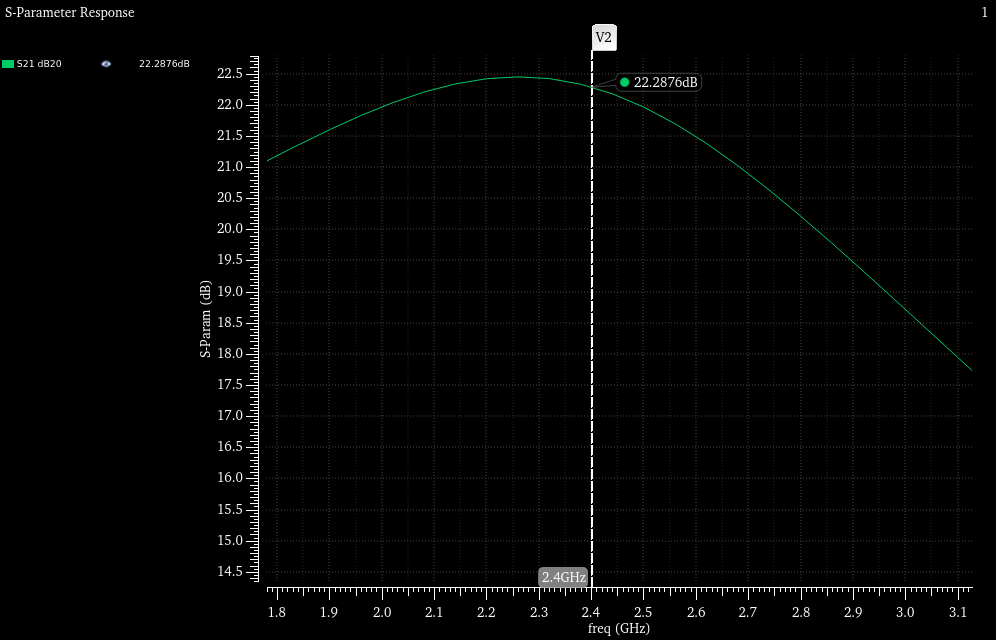
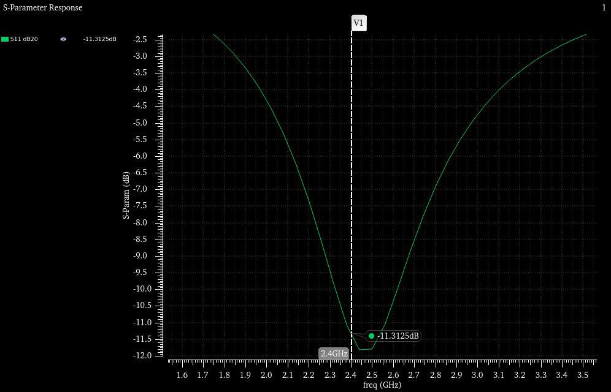
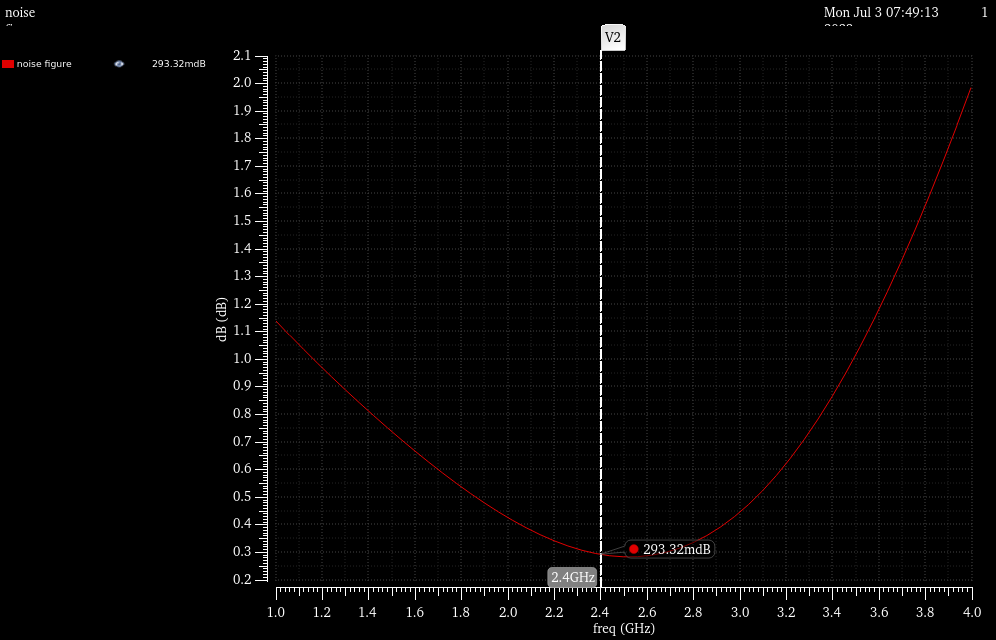
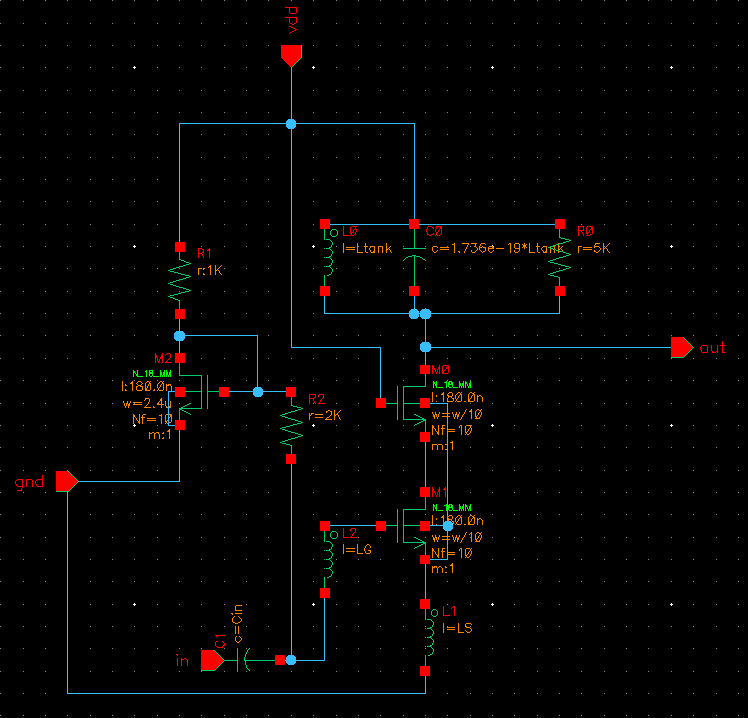
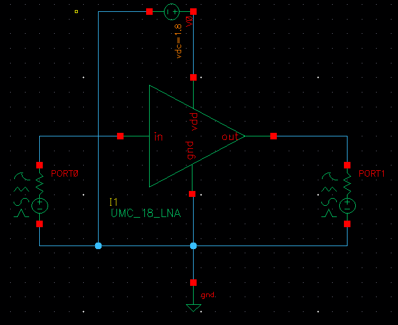

# LNA Project

This project focuses on the design and implementation of a Low-Noise Amplifier (LNA) using the UMC 180nm process.

## Description

The LNA is designed to operate in the frequency range of 2.38 - 2.42 GHz with a minimum gain of 10 dB. It aims to achieve a return loss of less than -10 dB, a noise figure below 10 dB, and a Q value of LRC less than 10. The LNA operates with a power supply voltage (Vdd) of 1.8V and has an output impedance of 5 kohms.

## Simulation Results

The simulation results for the LNA design are presented below:

- Gain

- Return Loss

- O1dB:
- OIP3:
- Noise Figure

- Power Consumption:

## Schematic

The schematic for the LNA design is displayed below:

These are the values of the variables on the schematic:

- Cin: 10pF
- LG: 9.14nH
- LS: 201pH
- Ltank: 14.57nH
- w: 240um

## Future Layout

The layout for the LNA design will be added here once it becomes available.

## License

This project is licensed under the [MIT License](../LICENSE).

